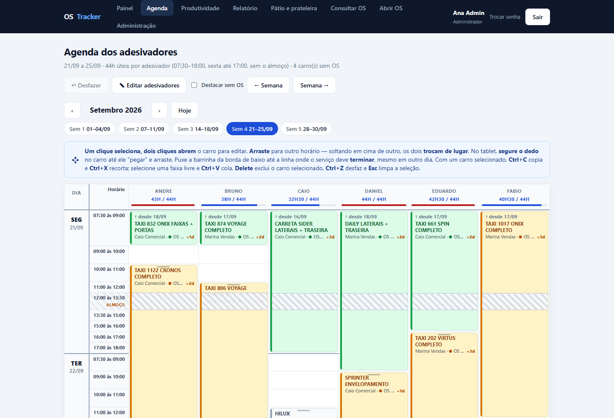
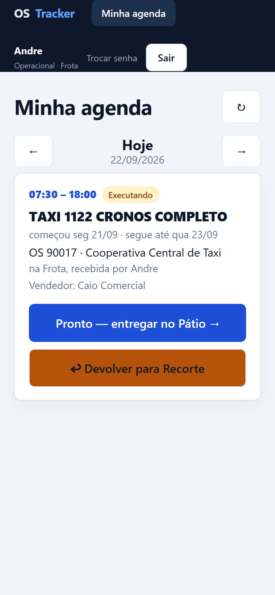
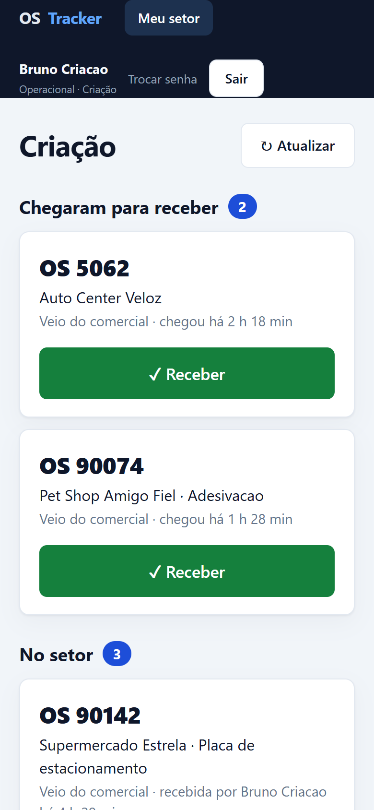
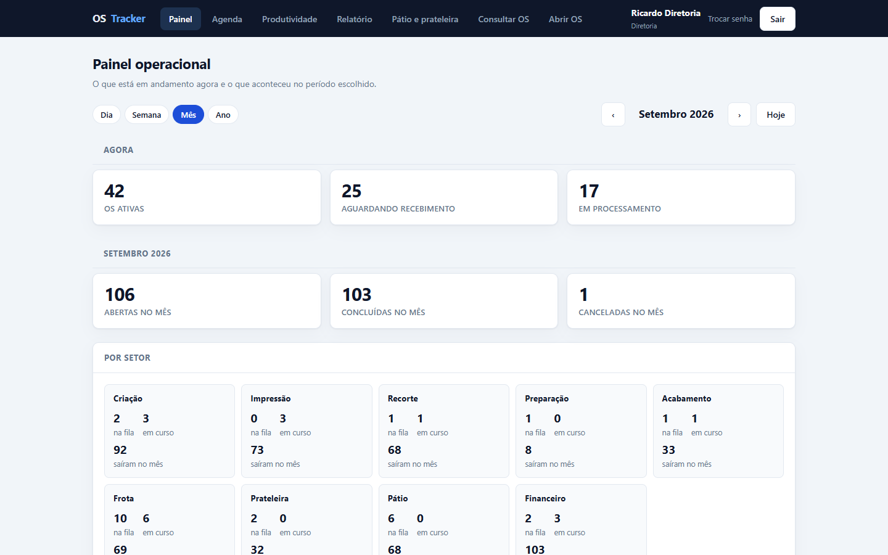
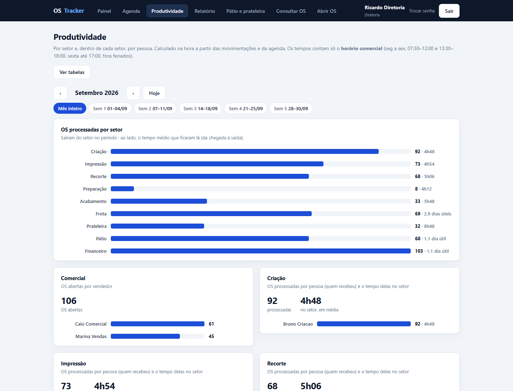
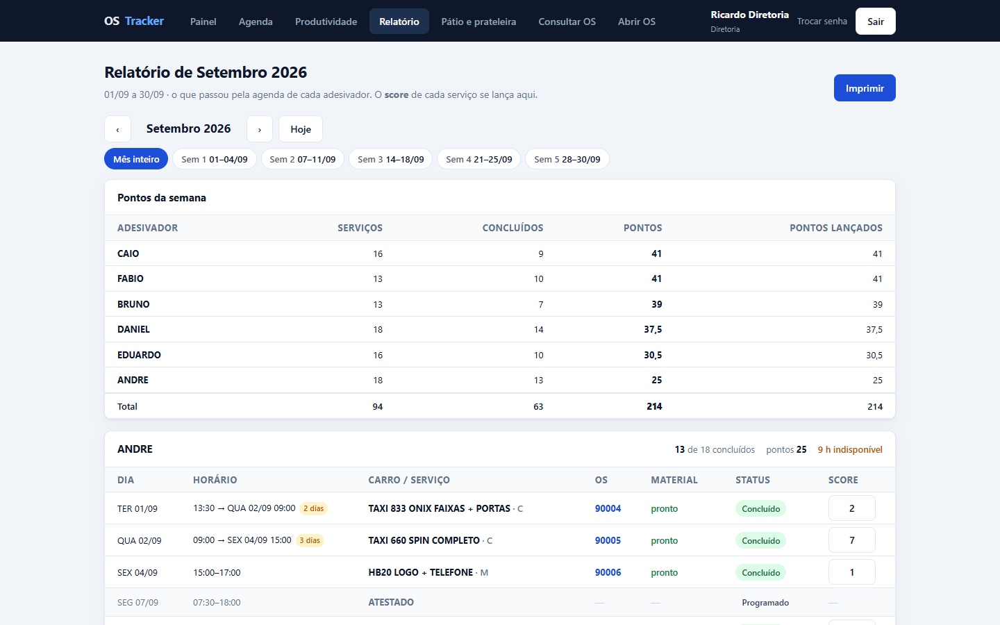
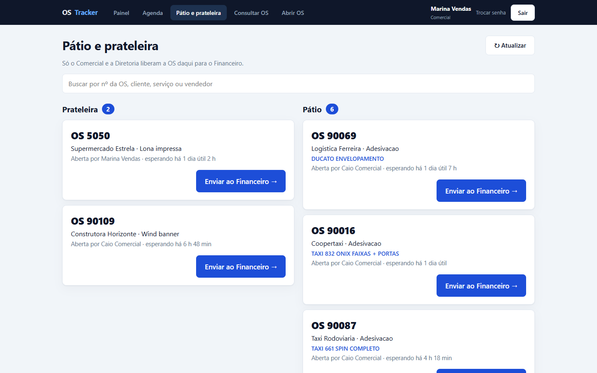

# OS Tracker

**Rastreabilidade de Ordens de Serviço e agenda de instalação para uma empresa de
comunicação visual** — em uso na operação desde setembro de 2026.

Kotlin · Spring Boot 3 · React 18 · TypeScript · PostgreSQL / H2 · Flyway · JWT

---

## O problema

Numa gráfica de comunicação visual, cada pedido passa por criação, impressão, recorte,
acabamento e pela frota que adesiva os veículos. Antes do sistema:

- ninguém sabia com certeza **onde estava** uma OS — perguntava-se no corredor;
- o tempo **parado na fila** se misturava com o tempo **de trabalho**, escondendo o gargalo;
- a agenda dos adesivadores vivia numa **planilha**, sem ligação com o andamento do material,
  e a carga de cada um era conta de cabeça.

## A solução

| | |
| :--- | :--- |
| **Rastreio por setor** | Cada OS anda de setor em setor pelos caminhos permitidos (matriz de transição). Receber, despachar, devolver, concluir: cada passo vira um **evento imutável** — quem, quando, de onde, para onde. |
| **Tela mínima para quem produz** | O operador vê só o seu setor e três botões: *Receber*, *Devolver*, *Despachar*. Sem digitar número de OS. |
| **Agenda dos adesivadores** | A grade semanal que substituiu a planilha: horários reais, arrastar e soltar (mouse e dedo), redimensionar pelas duas bordas, trocar de lugar, copiar/recortar/colar, **desfazer persistido**. |
| **A agenda acompanha a produção** | Cada carro liga-se à OS do material: a grade mostra se está pronto, e quando a Frota recebe ou entrega a OS o carro muda sozinho para *Executando* ou *Concluído*. |
| **Minha agenda, no celular** | Cada adesivador vê só os próprios carros do dia e recebe, entrega ou devolve a OS de cada um dali. |
| **Indicadores no próprio sistema** | Painel por dia/semana/mês/ano, produtividade por setor e por pessoa, relatório com a pontuação de cada adesivador — tudo calculado na leitura a partir dos eventos, **em horário comercial**. |

Cinco perfis (Administrador, Diretoria, Comercial, Financeiro, Operacional), com as
permissões validadas **no servidor**, rota por rota.

## Telas

> Versão pública do projeto: marca neutra e **todos os dados são fictícios** — clientes,
> pessoas e serviços foram gerados para a demonstração.

**Agenda dos adesivadores** — grade semanal com carga por pessoa, arrastar e soltar e o estado do material de cada carro.



| Minha agenda (celular) | Meu setor (celular) |
| :---: | :---: |
|  |  |

**Painel operacional**



**Produtividade por setor e por pessoa**



**Relatório do mês com a pontuação de cada adesivador**



**Pátio e prateleira** — onde o Comercial libera a OS pronta para o Financeiro.



## Decisões técnicas que valem destaque

- **Eventos imutáveis, indicadores derivados.** A tabela de eventos só recebe inserções; nenhum
  número é guardado em paralelo. Corrigir uma regra — um feriado, a sexta terminando às 17h —
  corrige o histórico inteiro na hora.
- **Tempo em horário comercial.** Uma OS que chega sexta às 16:00 e é recebida segunda às 08:00
  esperou 1h30, não 64 horas. O relógio pula noites, almoço, fins de semana e feriados.
- **A agenda é uma régua contínua de faixas.** Cada dia tem 9 faixas de horário reais (com
  1h30 e 1h); um serviço longo atravessa o almoço e a noite sem se partir. O mesmo cálculo roda
  no servidor (autoridade) e no navegador (prévia instantânea), e os testes garantem que batem.
- **Reempilhamento "em onda".** Ao mexer num carro, só são empurrados os que ele alcança;
  horários escolhidos e sobreposições antigas que ninguém tocou ficam onde estão.
- **Desfazer por retrato.** Antes de cada alteração, o trecho afetado da agenda é fotografado
  no banco — o Ctrl+Z desfaz também os carros que foram empurrados, e sobrevive a um reinício.
- **Semana cortada no mês.** Agenda e relatórios navegam por mês como as abas da planilha
  antiga: 28/09–02/10 vira 28–30/09 em setembro e 01–02/10 em outubro.
- **Migrações com rede de proteção.** Flyway versiona o esquema (V1–V9); antes de aplicar uma
  migração pendente o sistema faz backup do banco. Mudanças de regra que afetam dados antigos
  viram migrações em Kotlin testadas.
- **Um banco para começar, outro para crescer.** H2 em arquivo roda numa máquina só; a mesma
  aplicação sobe num PostgreSQL de verdade num teste automatizado.

## Arquitetura

```
 Navegador (computador / celular)
        │  React 18 + TypeScript (Vite) — telas por perfil, régua da agenda
        ▼
 Spring Boot 3 (Kotlin) ── um único .jar serve a API /api/** e a tela
   ├── Security: JWT + BCrypt, regras por rota e por perfil
   ├── Serviços: fluxo de OS, agenda (régua, reempilhar, desfazer), indicadores
   └── JPA + Flyway
        ▼
 H2 em arquivo (padrão)  ou  PostgreSQL (por variável de ambiente)
```

## Qualidade

- **126 testes no backend** (JUnit 5): regras de cada tela, permissões de cada perfil por HTTP,
  a agenda (troca, bordas, carga, sexta 17h, corte do mês), importação da planilha conferida
  semana a semana contra o total da própria planilha, número fixo de consultas SQL por tela,
  backup que restaura e a aplicação inteira sobre um **PostgreSQL 14 embutido**.
- **22 testes no frontend** (Vitest): as contas da grade no navegador batem com as do servidor.
- O pacote de produção **não é gerado** se um teste falhar.

## Rodar

Pré-requisitos: JDK 21+, Node.js 20+ e Maven 3.9 — os scripts acham cada um sozinhos, sem caminho fixo.

```bash
powershell -ExecutionPolicy Bypass -File .\gerar-pacote.ps1
```

```bash
powershell -ExecutionPolicy Bypass -File .\iniciar-producao.ps1
```

Abra <http://localhost:8080>. Num banco novo, o primeiro acesso é pelo usuário `admin`, com a
senha provisória que aparece **uma vez** no log. Para desenvolver com recarga instantânea, testes,
backup, PostgreSQL e todas as telas, veja o **[guia de operação](./COMO-EXECUTAR.md)**.

## Estrutura

```
backend/     API Kotlin/Spring Boot, migrações Flyway e testes
frontend/    Tela React/TypeScript e testes Vitest
docs/        Especificação: processo, perfis, requisitos, regras, indicadores, modelo de dados
scripts/     Utilitários
*.ps1        Gerar pacote, subir, instalar como serviço, backup/restauração, importar a planilha
```

## Documentação

1. [Visão geral](./docs/01-visao-geral.md)
2. [Análise do processo](./docs/02-analise-do-processo.md)
3. [Perfis e permissões](./docs/03-stakeholders-e-permissoes.md)
4. [Requisitos](./docs/04-requisitos.md)
5. [Regras de negócio](./docs/05-regras-de-negocio.md)
6. [Matriz de transição](./docs/06-fluxos-e-matriz-de-transicao.md)
7. [Indicadores](./docs/07-kpis-e-analytics.md)
8. [Roadmap](./docs/08-roadmap.md)
9. [Caminho para produção](./docs/09-caminho-para-producao.md)
10. [Modelo de dados](./docs/10-modelo-de-dados.md)

Operação do dia a dia: [COMO-EXECUTAR.md](./COMO-EXECUTAR.md).

## Status

Em uso na operação de uma empresa de comunicação visual, na rede interna, por computador e
celular. Este repositório é a versão pública: mesmo código, sem a marca nem os dados da
empresa. Próximos passos — backup fora da máquina, HTTPS e monitoramento — estão em
[Caminho para produção](./docs/09-caminho-para-producao.md).

---

Desenvolvido por **Wender**, com a análise do processo feita junto da operação.
